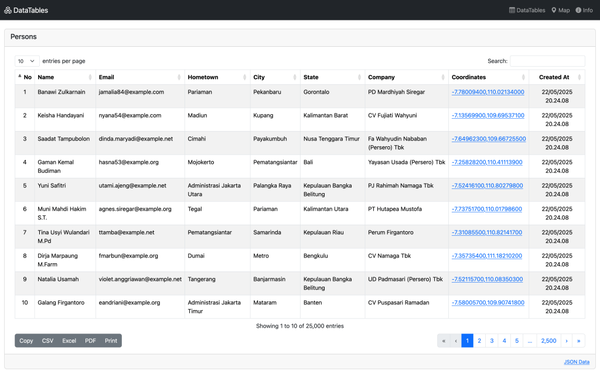
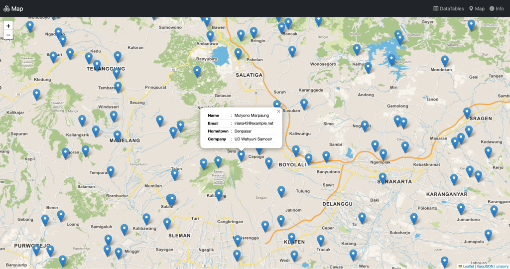

# Laravel Server Side Example

## Installation
1. Clone this repository
2. Create a new database
3. Copy `.env.example` to `.env` and set your database connection
4. Run `composer install`
5. Run `php artisan key:generate`
6. Run `php artisan migrate:fresh --seed` to create the database tables
7. Run `php artisan serve` to start the development server
8. Open your browser and go to `http://localhost:8000` to see the application in action

## Features
1. Using server-side DataTables to sort, search, and paginate a list of 25,000 people
2. Displaying the locations of 25,000 people on a map using Leaflet.js controlled by bounding box coordinates
3. Using Bootstrap for styling and layout

## Screenshots

___
> unsorry@2025